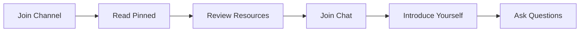

<div align="center">


# ⚡ Official USDT Sender ⚡

### Your trusted source for Flash USDT education, security practices, and scam awareness

[](https://t.me/OfficialUSDTSender)
[](https://t.me/USDTCoordinator)
[](https://t.me/OfficialUSDTSender)

**Official Links:**  
➡️ https://t.me/OfficialUSDTSender  
➡️ https://t.me/USDTCoordinator


-----

## 🔒 SECURITY NOTICE

> **Official links only.**  
> We **NEVER** send private messages.  
> We **NEVER** ask for keys, seed phrases, or payments.  
> We **NEVER** guarantee profits or "instant money."  
> If someone does—**it's a scam. Report immediately.**

</div>

## ⚠️ Important Disclaimer

**This organization is NOT affiliated with:**
- Tether Limited or Tether Operations Limited
- Telegram Messenger Inc.
- Any official blockchain foundation or protocol

We are an **independent educational community** focused on:
- ✅ Honest reviews and scam alerts
- ✅ Flash USDT mechanics explained
- ✅ Security best practices
- ✅ Community coordination and support

**We do NOT provide financial services, investment advice, or real USDT transfers.**

-----

## 🎯 Mission & Purpose

<div align="center">

| Focus Area      | Description                                                      |
|:---------------:|:-----------------------------------------------------------------|
| 🎓 **Educate**  | Demystify Flash USDT, blockchain concepts, and crypto fundamentals |
| 🛡️ **Protect**  | Help users identify scams, phishing, and fraudulent schemes      |
| 🤝 **Connect**   | Build a community of informed, security-conscious users          |
| 🔍 **Review**    | Provide unbiased assessments of tools and platforms              |
| 📢 **Alert**     | Real-time warnings about emerging threats and scams              |

</div>

-----

## 🔹 What We Provide

### 📖 Educational Content
- **Realistic explanations** of Flash USDT mechanics
- Blockchain security fundamentals
- Wallet safety protocols and best practices
- Transaction verification techniques
- Risk assessment frameworks

### 🛠️ Tools & Reviews
- **Curated tools** with complete risk disclosures
- **Unbiased reviews** of trending platforms and services
- Comparison guides for wallets and exchanges
- Step-by-step security setup tutorials

### 🚨 Scam Prevention
- ⚡ Real-time scam alerts and warnings
- 🚩 Red flag identification guides
- 📊 Community-reported fraud database
- 💬 Support for scam victims
- 🔗 Verified links and resources only

### 👥 Community Coordination
- Safe discussion environment
- Peer-to-peer learning and mentorship
- Expert Q&A sessions
- Resource sharing hub

-----

## 🛡️ Security Best Practices

<div align="center">

### 🔐 Golden Rules of Crypto Safety

</div>

```plaintext
1. NEVER share your private keys or seed phrases with anyone
2. ALWAYS verify links before clicking (check for typos)
3. USE hardware wallets for significant amounts
4. ENABLE 2FA on all crypto-related accounts
5. RESEARCH thoroughly before any transaction
6. DOUBLE-CHECK wallet addresses (compare first & last chars)
7. IGNORE unsolicited private messages
8. TRUST NO ONE claiming "guaranteed returns"
9. KEEP software and wallets updated
10. STORE backups securely offline
```

### ⚠️ Common Scam Tactics

| Scam Type         | Description                      | Protection                 |
|-------------------|----------------------------------|----------------------------|
| **Impersonation** | Fake admins/support in DMs       | We never DM first          |
| **Phishing Links**| Fake websites stealing credentials | Verify URLs carefully    |
| **Pump & Dump**   | Fake investment opportunities    | No legitimate "guarantees" |
| **Wallet Drainers**| Malicious smart contracts       | Review before signing      |
| **Ponzi Schemes** | "Guaranteed" high returns        | If it's too good, it's false |

-----

## 📚 Educational Resources

<details>
<summary><strong>📘 Beginner Topics</strong></summary>

- What is USDT (Tether)?
- Understanding Flash USDT vs Real USDT
- Blockchain basics and how it works
- Wallet types and security
- Reading blockchain explorers
- Gas fees explained

</details>

<details>
<summary><strong>📙 Intermediate Topics</strong></summary>

- Transaction verification methods
- Smart contract interactions
- DeFi protocols overview
- Liquidity pools and risks
- Advanced wallet management
- Privacy and anonymity

</details>

<details>
<summary><strong>📕 Advanced Topics</strong></summary>

- Flash loan mechanics and risks
- Smart contract auditing basics
- MEV (Miner Extractable Value)
- Cross-chain bridges security
- On-chain analysis techniques
- Advanced threat modeling

</details>

-----

## ⚡ Quick Start Guide

### For New Members

<div align="center">



</div>

1. **Join**: [@OfficialUSDTSender](https://t.me/OfficialUSDTSender) channel
2. **Read**: Pinned message for latest updates
3. **Review**: Educational materials in Files section
4. **Join**: [@USDTCoordinator](https://t.me/USDTCoordinator) chat
5. **Engage**: Introduce yourself respectfully
6. **Learn**: Ask questions and share knowledge

### Getting Help

| Need              | Action                       |
|-------------------|------------------------------|
| ❓ General Question | Post in coordinator chat     |
| 🚨 Report Scam      | Contact admins directly      |
| 🐛 Technical Issue  | Describe problem with details|
| 💡 Suggestion       | Share feedback with moderators|
| 📚 Learning Resource| Check pinned files first     |

-----

## 🤝 Community Guidelines

### ✅ We Encourage
- 💬 Respectful, constructive communication
- 🎓 Knowledge sharing and teaching
- 🧠 Critical thinking and healthy skepticism
- 🔄 Constructive feedback
- 🤲 Helping newcomers learn

### ❌ We Prohibit
- 🚫 Scamming, fraud, or deceptive practices
- 📢 Spam, advertising, or unsolicited promotions
- 🔓 Sharing private keys or sensitive information
- 😡 Harassment, abuse, or disrespect
- 📰 Spreading misinformation or FUD
- 💸 Soliciting payments or "guaranteed" schemes

**Violations result in warnings, muting, or permanent bans.**

-----

## ❓ Frequently Asked Questions

<details>
<summary><strong>What exactly is Flash USDT?</strong></summary>

Flash USDT typically refers to temporary test tokens or simulated transactions used for blockchain development and testing. They **are not real USDT** and hold no actual value. They should never be treated as legitimate currency or used for real transactions.

**Key points:**
- Not backed by real assets
- Cannot be withdrawn to real money
- Used only for testing/demonstration
- Often expire or disappear quickly
- Frequently used in scam schemes

</details>

<details>
<summary><strong>Is this service affiliated with Tether or Telegram?</strong></summary>

**No.** We are a completely independent educational community. We have:
- No affiliation with Tether Limited
- No connection to Telegram Inc.
- No official blockchain partnerships
- No financial licensing or authority

We exist solely to educate and protect users.

</details>

<details>
<summary><strong>How do I identify a USDT scam?</strong></summary>

**Red flags include:**
🚩 Promises of guaranteed returns or "risk-free" profits  
🚩 Requests for private keys, seed phrases, or wallet passwords  
🚩 Pressure to act quickly ("limited time offer")  
🚩 Unverified or suspicious links  
🚩 Unsolicited private messages from "support"  
🚩 Too-good-to-be-true exchange rates  
🚩 Requests for upfront payment or "activation fees"  
🚩 Claims of official partnerships without proof

**When in doubt, ask in our community first.**

</details>

<details>
<summary><strong>Do you provide financial or investment advice?</strong></summary>

**Absolutely not.** We provide:
- Educational content only
- Security best practices
- Scam awareness information
- Community support

We do NOT:
- Recommend specific investments
- Guarantee any returns
- Provide financial planning
- Offer legal or tax advice

**Always consult qualified professionals for financial decisions.**

</details>

<details>
<summary><strong>Can I trust tools shared in your channels?</strong></summary>

We share tools for **educational purposes only** with full risk disclosures. However:
- ⚠️ Use any tool at your own risk
- 🔍 Always research independently
- 🧪 Test with small amounts first
- 🛡️ Verify source code when possible
- 💬 Ask questions before using

**We are not responsible for third-party tools or services.**

</details>

<details>
<summary><strong>How can I contribute to the community?</strong></summary>

We welcome contributions:
- 📚 Share educational resources
- 🚨 Report scams you encounter
- ❓ Answer questions from newcomers
- ✍️ Write guides or tutorials
- 🔍 Review and verify information
- 🤝 Maintain a positive environment

**Quality over quantity—every helpful contribution matters.**

</details>

<details>
<summary><strong>What should I do if I've been scammed?</strong></summary>

**Immediate steps:**
1. **Stop all communication** with the scammer
2. **Document everything** (screenshots, addresses, messages)
3. **Report to authorities** (local cybercrime unit)
4. **Warn the community** (share details in chat)
5. **Secure your accounts** (change passwords, enable 2FA)
6. **DO NOT** pay "recovery services" (likely another scam)

**Recovery is difficult, but reporting helps protect others.**

</details>

-----

## 📞 Contact & Support

<div align="center">

### Need Help?

| Issue Type        | Contact Method                                      |
|:-----------------:|:----------------------------------------------------|
| 💬 General Questions | [@USDTCoordinator](https://t.me/USDTCoordinator)    |
| 🚨 Report Scam      | Contact channel admins                              |
| 🐛 Technical Problem | Post in chat with details                           |
| 💡 Feedback/Ideas   | Message moderators                                  |
| 📢 Announcements    | [@OfficialUSDTSender](https://t.me/OfficialUSDTSender)|

</div>

### Official Communication Channels
We **ONLY** communicate through:
- ✅ https://t.me/OfficialUSDTSender (Channel)
- ✅ https://t.me/USDTCoordinator (Chat)

**Any other channel, DM, or website claiming to be us is a scam.**

-----

## 🏷️ Keywords & Topics
`Flash USDT` · `USDT Tools` · `Crypto Safety` · `Scam Alerts` · `Blockchain Education` · `Tether Education` · `Cryptocurrency Security` · `DeFi Safety` · `Wallet Security` · `Crypto Community`

-----

<div align="center">

## ⭐ Stay Safe, Stay Informed, Stay Skeptical ⭐

### 🔒 Remember: If it seems too good to be true, it probably is.

[](https://t.me/OfficialUSDTSender)

-----

**Made with 💜 by the Official USDT Sender Team**  
*Last Updated: December 29, 2024*  
**Version:** 2.0.0 · **License:** Educational Use Only · **Status:** Active & Maintained

</div
